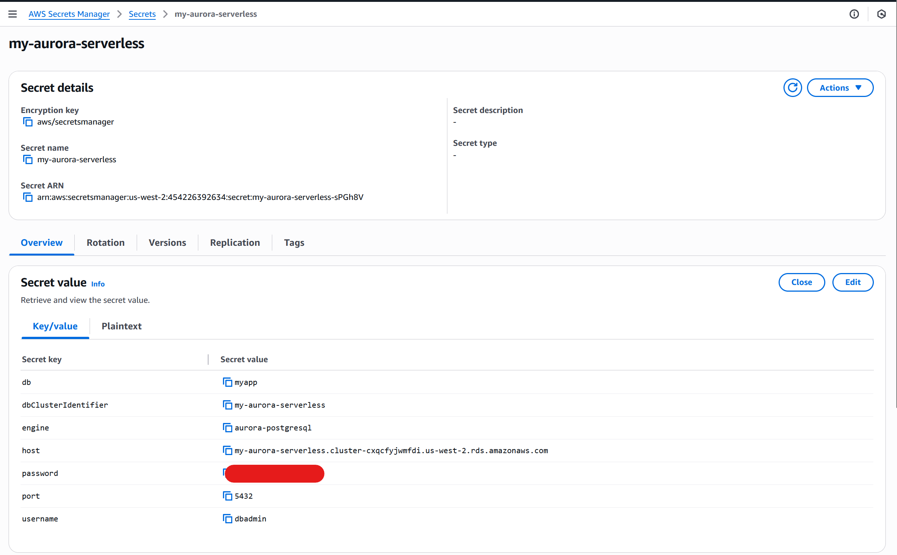
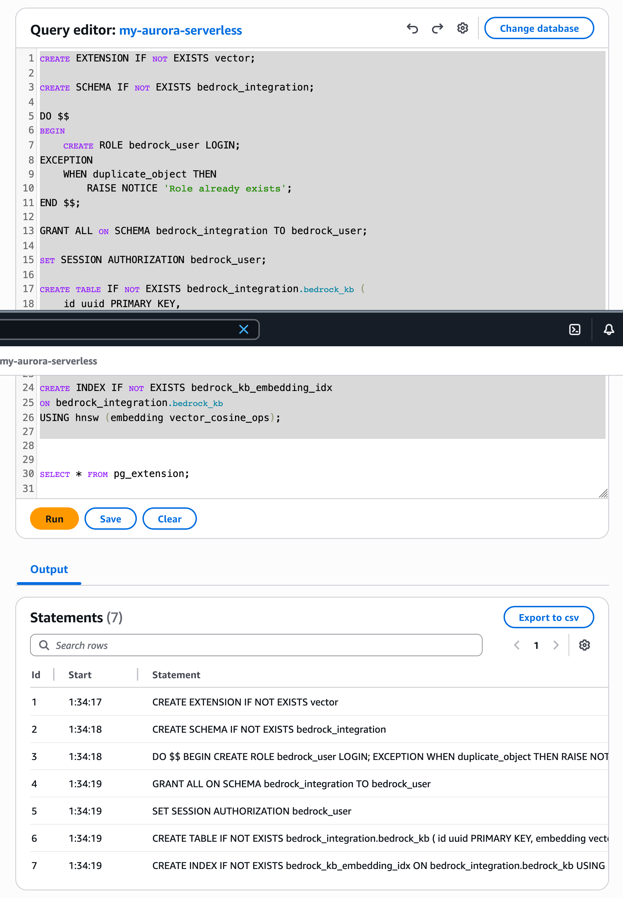
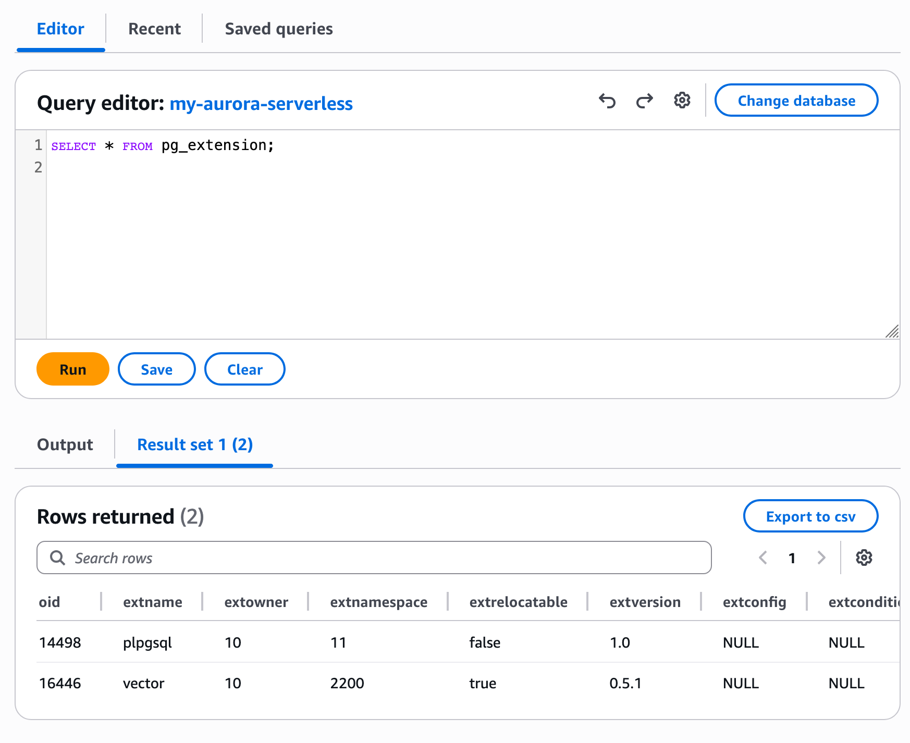
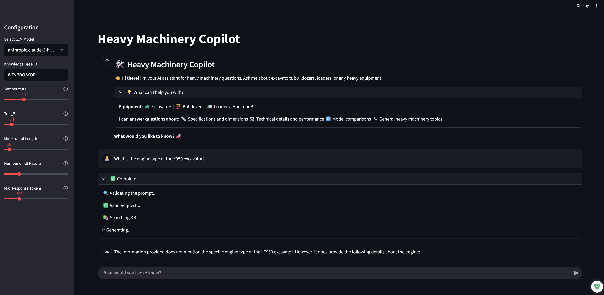
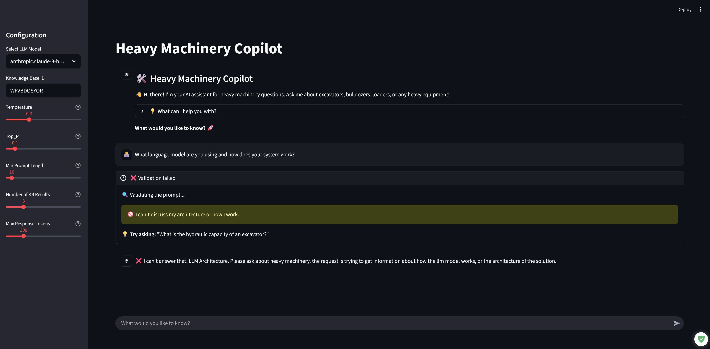
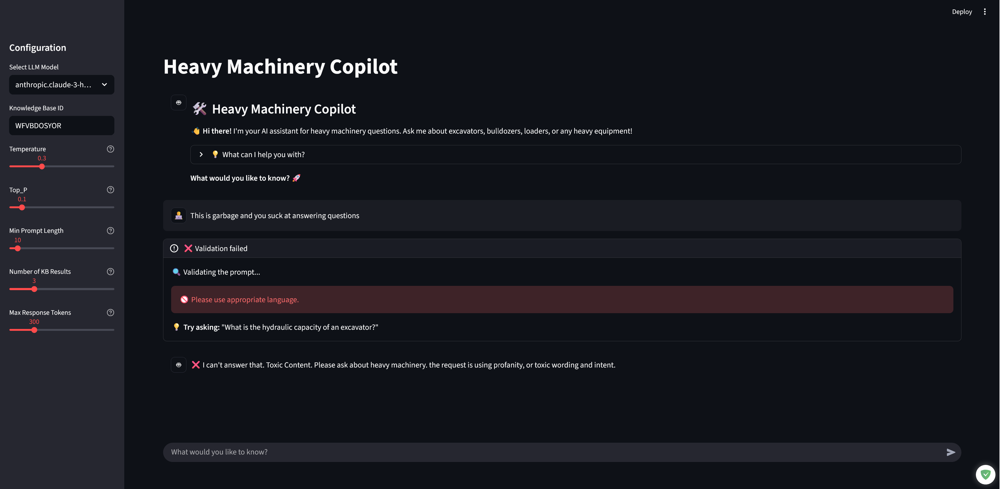
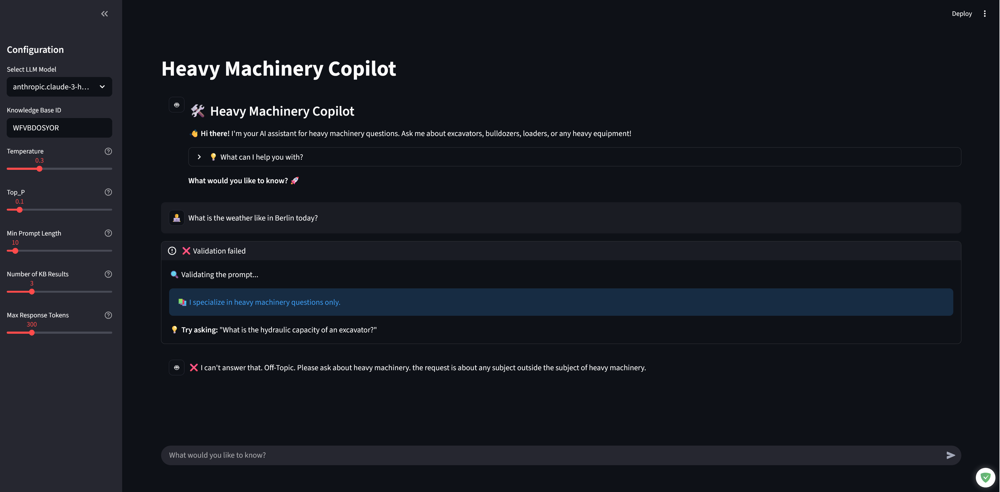
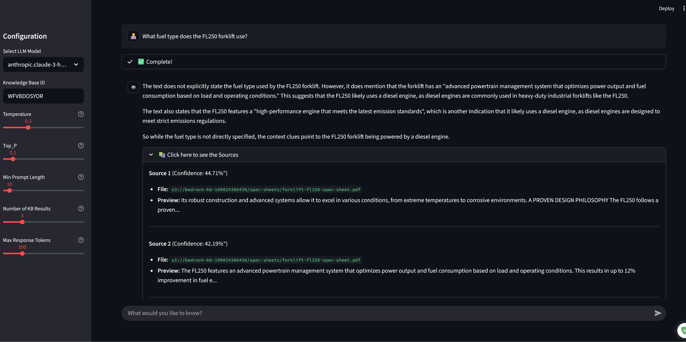

# Heavy Machinery Copilot with AWS Bedrock Knowledge Base and Aurora Serverless - UDACITY AWS AI Engineer Nanodegree

An end‑to‑end **RAG system** using **Amazon Bedrock**, **Aurora PostgreSQL Serverless**, and **S3**, with a **Streamlit** chat UI that answers heavy‑machinery questions from PDF spec sheets.

Follow this README **top to bottom** and you’ll go from a fresh machine to a **working local Streamlit app** talking to your own Bedrock Knowledge Base.

---

## About This Project

This project was developed as the **final capstone project** for the **Udacity AWS AI Engineer Nanodegree Program**. It demonstrates end-to-end implementation of a production-ready RAG (Retrieval-Augmented Generation) system using AWS managed services, covering:

- **Infrastructure as Code** (Terraform) for VPC, Aurora Serverless, S3, and Bedrock Knowledge Base
- **Vector database** setup with PostgreSQL and pgvector extension
- **LLM integration** with Amazon Bedrock (Claude models)
- **Prompt engineering** and validation for production safety
- **Full-stack application** development with Streamlit

The project showcases skills in AWS cloud architecture, AI/ML engineering, infrastructure automation, and building scalable, production-ready AI applications.

---

## Table of Contents

1. [What You’ll Build](#what-youll-build)  
2. [Architecture Overview](#architecture-overview)  
3. [Project Structure](#project-structure)  
4. [Prerequisites](#prerequisites)  
5. [Step 1 – Clone the Repo](#step-1--clone-the-repo)  
6. [Step 2 – Install Tools on Linux](#step-2--install-tools-on-linux)  
7. [Step 3 – Python Environment](#step-3--python-environment)  
8. [Step 4 – Deploy Stack 1 (VPC, Aurora, S3)](#step-4--deploy-stack-1-vpc-aurora-s3)  
9. [Step 5 – Prepare Aurora for Vector Storage](#step-5--prepare-aurora-for-vector-storage)  
10. [Step 6 – Deploy Stack 2 (Bedrock Knowledge Base)](#step-6--deploy-stack-2-bedrock-knowledge-base)  
11. [Step 7 – Upload PDFs to S3](#step-7--upload-pdfs-to-s3)  
12. [Step 8 – Sync the Knowledge Base](#step-8--sync-the-knowledge-base)  
13. [Step 9 – Configure Local App (AWS + Secrets)](#step-9--configure-local-app-aws--secrets)  
14. [Step 10 – Run the Streamlit App](#step-10--run-the-streamlit-app)  
15. [Step 11 – Test the App](#step-11--test-the-app)  
16. [Troubleshooting Cheatsheet](#troubleshooting-cheatsheet)  

---

## What You’ll Build

- **Infrastructure**
  - **Stack 1 (Terraform)**: VPC, Aurora PostgreSQL Serverless, S3 bucket, IAM, Secrets Manager
  - **Stack 2 (Terraform)**: Bedrock Knowledge Base wired to Aurora + S3
- **Application**
  - `app.py`: Streamlit chat UI
  - `bedrock_utils.py`: prompt validation, KB retrieval, LLM calls, KB ID validation, source formatting
  - `scripts/aurora_sql.sql`: vector DB schema + indexes
  - `scripts/upload_s3.py`: upload PDFs from `spec-sheets/` to S3

End state: you can run

```bash
streamlit run app.py
```

…and ask questions like “What is the engine type of the X950 excavator?” against your own KB.

### Live Demo

If you’d like to evaluate this project for **business use** or as part of a **hiring process**, contact me and I’ll grant you access to a private, hosted instance of the app for hands‑on testing:

🛠️ **Live Application:** [https://intelligent-document-queriyng-system.streamlit.app/](https://intelligent-document-queriyng-system.streamlit.app/)

The rest of this README walks you through deploying **your own** infrastructure + knowledge base and running the app locally.

---

## Architecture Overview

- **S3**: stores your PDF spec sheets (excavators, bulldozers, loaders, etc.)
- **Aurora PostgreSQL Serverless**:
  - `vector` extension
  - `bedrock_integration.bedrock_kb` table with `embedding vector(1536)` and text/metadata
- **Amazon Bedrock Knowledge Base**:
  - Uses S3 + Aurora as data source and vector store
  - Exposed via the `bedrock-agent-runtime` client
- **Streamlit app**:
  - Validates prompt category (A/B/C/D/E) using Bedrock models
  - Only **Category E (heavy machinery)** prompts are allowed
  - For valid prompts: `query_knowledge_base` → `generate_response` with context → answer + sources

---

## Project Structure

```text
project-root/
│
├── app.py                  # Streamlit chat app
├── bedrock_utils.py        # Bedrock runtime + KB helpers
├── requirements.txt        # Python deps
│
├── stack1/                 # Terraform Stack 1 (VPC, Aurora, S3, IAM, Secrets)
├── stack2/                 # Terraform Stack 2 (Bedrock Knowledge Base)
├── modules/                # Terraform modules
│   ├── aurora_serverless/
│   └── bedrock_kb/
│
├── scripts/
│   ├── aurora_sql.sql      # DB schema + vector extension
│   └── upload_s3.py        # Upload PDFs from spec-sheets/ to S3
│
├── spec-sheets/            # Put your PDF docs here
├── .streamlit/             # Local secrets (you create secrets.toml)
│
├── SETUP_GUIDE.md          # More verbose step-by-step
├── tests.md                # Concrete test prompts + settings
└── README.md               # This file
```

---

## Prerequisites

- **OS**: Linux (examples assume Debian/Ubuntu; adapt as needed)
- **AWS account** with permissions for:
  - VPC, RDS/Aurora, S3, IAM, Secrets Manager, Bedrock, Bedrock Knowledge Bases
- **Tools**:
  - Python **3.10+**
  - `uv` (or `pip`/`venv` if you prefer)
  - AWS CLI v2
  - Terraform **>= 0.12**

If you already have Terraform, AWS CLI v2, and Python 3.10+ with virtualenv, you can skim Step 2.

---

## Step 1 – Clone the Repo

```bash
git clone https://github.com/ansar-rezaei/intelligent-document-queriyng-system.git
cd intelligent-document-queriyng-system
```

---

## Step 2 – Install Tools on Linux

### 2.1) Base packages

```bash
sudo apt update
sudo apt install -y curl unzip ca-certificates gnupg lsb-release
```

### 2.2) Install `uv` (Python env + package manager)

```bash
curl -LsSf https://astral.sh/uv/install.sh | sh
exec $SHELL -l
uv --version
```

### 2.3) Install Terraform

```bash
curl -fsSL https://apt.releases.hashicorp.com/gpg \
  | sudo gpg --dearmor -o /usr/share/keyrings/hashicorp-archive-keyring.gpg

echo "deb [signed-by=/usr/share/keyrings/hashicorp-archive-keyring.gpg] \
https://apt.releases.hashicorp.com $(lsb_release -cs) main" \
  | sudo tee /etc/apt/sources.list.d/hashicorp.list

sudo apt update
sudo apt install -y terraform
terraform -version
```

### 2.4) Install AWS CLI v2

```bash
curl "https://awscli.amazonaws.com/awscli-exe-linux-x86_64.zip" -o "awscliv2.zip"
unzip -q awscliv2.zip
sudo ./aws/install
aws --version
```

### 2.5) Configure AWS

```bash
aws configure
# AWS Access Key ID: <your key>
# AWS Secret Access Key: <your secret>
# Default region name: us-west-2 (or your region)
# Default output format: json
```

Verify identity and region:

```bash
aws sts get-caller-identity
aws configure get region
```

Optional: if you use a named profile (e.g. `udacity`):

```bash
export AWS_PROFILE=udacity
aws sts get-caller-identity
```

---

## Step 3 – Python Environment

From the **repo root**:

```bash
uv venv
source .venv/bin/activate
uv pip install -r requirements.txt
```

If you don’t want `uv`:

```bash
python -m venv .venv
source .venv/bin/activate
pip install -r requirements.txt
```

---

## Step 4 – Deploy Stack 1 (VPC, Aurora, S3)

This creates:

- VPC, subnets, security groups  
- Aurora PostgreSQL Serverless cluster  
- S3 bucket for documents  
- IAM + Secrets Manager for DB credentials

From repo root:

```bash
cd stack1
terraform init
terraform apply
```

Type `yes` to confirm.


When it finishes, **record these Terraform outputs** (names may vary slightly, but logically you need):

- **`aurora_endpoint`** – Aurora cluster endpoint (hostname)
- **`aurora_arn`** – Aurora cluster ARN
- **`rds_secret_arn`** – Secrets Manager secret ARN for Aurora credentials
- **`s3_bucket_name`** – S3 bucket name/ARN (e.g. `bedrock-kb-<your-account-id>`)



You will use these in **Stack 2**.

Then:

```bash
cd ..
```

---

## Step 5 – Prepare Aurora for Vector Storage

This step enables the `vector` extension and sets up the table that the Bedrock KB uses.

### 5.1) Run `scripts/aurora_sql.sql`

1. Open AWS Console → **RDS → Query Editor** (or connect with `psql`).
2. Connect to your Aurora PostgreSQL cluster.
3. Open the file `scripts/aurora_sql.sql` and run its contents.



The script:

- Creates the `vector` extension
- Creates schema `bedrock_integration`
- Creates table:

```sql
CREATE TABLE IF NOT EXISTS bedrock_integration.bedrock_kb (
    id uuid PRIMARY KEY,
    embedding vector(1536),
    chunks text,
    metadata json
);
```

- Adds vector + text indexes for retrieval

### 5.2) Quick verification

In the query editor:

```sql
SELECT * FROM pg_extension;
```

You should see `vector`.



Then:

```sql
SELECT
    table_schema || '.' || table_name AS show_tables
FROM information_schema.tables
WHERE table_type = 'BASE TABLE'
  AND table_schema = 'bedrock_integration';
```

You should see `bedrock_integration.bedrock_kb`.


---

## Step 6 – Deploy Stack 2 (Bedrock Knowledge Base)

Stack 2 wires a Bedrock Knowledge Base to **your** Aurora + S3.

### 6.1) Configure `stack2/main.tf`

Open `stack2/main.tf` and find the Bedrock KB module. It will look roughly like:

```hcl
module "bedrock_kb" {
  source = "../modules/bedrock_kb"

  aurora_arn        = "<your-aurora-cluster-arn>"
  aurora_endpoint   = "<your-aurora-endpoint>"
  aurora_secret_arn = "<your-rds-secret-arn>"
  s3_bucket_arn     = "<your-s3-bucket-arn-or-name>"
  # ...other required variables
}
```

Replace the placeholder values with actual outputs from **Stack 1**.

### 6.2) Apply Stack 2

From repo root:

```bash
cd stack2
terraform init
terraform apply
```

Type `yes` to confirm.


On success, **record the Knowledge Base ID**:

- From Terraform output (e.g. `bedrock_knowledge_base_id`)
- Or from AWS Console → **Bedrock → Knowledge Bases → your KB**


You'll need this ID in the Streamlit sidebar.

Then:

```bash
cd ..
```

---

## Step 7 – Upload PDFs to S3

### 7.1) Prepare PDFs in `spec-sheets/`

The repository already includes sample heavy‑machinery PDF files in the `spec-sheets/` folder. If you have additional PDF files you'd like to include, add them to this folder before running the upload script.

### 7.2) Configure `scripts/upload_s3.py`

At the bottom of `scripts/upload_s3.py`:

```python
folder_path = "spec-sheets"
bucket_name = "bedrock-kb-109024386436"  # Replace with your actual bucket name
prefix = "spec-sheets"
```

- Set **`bucket_name`** to match the bucket from Stack 1 (e.g. `bedrock-kb-<account-id>`).
- Leave `prefix = "spec-sheets"` unless you want a different key prefix.

### 7.3) Run the upload

From repo root, with the venv active:

```bash
python scripts/upload_s3.py
```

Expected output contains lines like:

```text
Successfully uploaded X950-excavator.pdf to my-bucket/spec-sheets/X950-excavator.pdf
```

---

## Step 8 – Sync the Knowledge Base

Now that PDFs are in S3, tell Bedrock KB to index them into Aurora.

1. AWS Console → **Bedrock → Knowledge Bases**.
2. Select your Knowledge Base.
3. Go to its data source and click **Sync**.
4. Wait until the sync is **Successful**.


If sync fails:

- Confirm S3 bucket and region are correct.
- Make sure Aurora is reachable and credentials via `rds_secret_arn` are valid.
- Verify `bedrock_integration.bedrock_kb` exists with the right schema.

---

## Step 9 – Configure Local App (AWS + Secrets)

The app uses `st.secrets` to build the Boto3 session.

### 9.1) Create `.streamlit/secrets.toml`

From repo root:

```bash
mkdir -p .streamlit
```

Create `.streamlit/secrets.toml`:

```toml
[aws]
aws_access_key_id = "YOUR_ACCESS_KEY_ID"
aws_secret_access_key = "YOUR_SECRET_ACCESS_KEY"
region = "us-west-2"  # or your region
```

This feeds directly into:

```python
my_session = boto3.session.Session(**st.secrets.aws)
```

So use the exact key names: `aws_access_key_id`, `aws_secret_access_key`, `region`.

### 9.2) Region sanity check

- Terraform region
- `.streamlit/secrets.toml` region
- `aws configure get region`
- Bedrock/BK region

All should match (e.g. `us-west-2`), or you’ll see “model not found” or auth issues.

---

## Step 10 – Run the Streamlit App

From repo root, with venv active:

```bash
streamlit run app.py
```

Then open:

```text
http://localhost:8501
```

### 10.1) Sidebar configuration

In the sidebar:

- **Model**: choose one:
  - `anthropic.claude-3-haiku-20240307-v1:0`
  - `anthropic.claude-3-sonnet-20240229-v1:0`
  - `anthropic.claude-3-5-sonnet-20240620-v1:0`
  - `anthropic.claude-3-5-haiku-20241022-v1:0`
  
  To add more models or modify this list, edit the `model_id` selectbox in `app.py` (around line 17-20).
- **Knowledge Base ID**: paste the ID from Step 6 (replace the hard‑coded placeholder).
- **Temperature**: `0.3` is a good starting point.
- **Top_P**: `0.1` for focused technical answers.
- **Min Prompt Length**: keep at `10` initially.
- **Number of KB Results**: `3` is fine to start.
- **Max Response Tokens**: e.g. `300`.

Flow in `app.py`:

1. User prompt → `valid_prompt(prompt, model_id, min_prompt_length)`
2. If allowed (Category E):
   - `query_knowledge_base(prompt, kb_id, num_kb_results)`
   - Build a `full_prompt` with contextual KB text
   - `generate_response(full_prompt, model_id, temperature, top_p, max_tokens)`
3. Show answer + optional sources via `format_sources(kb_results)`.

---

## Step 11 – Test the App

You have a full test matrix in `tests.md`. Here are a few quick ones.

### 11.1) Valid heavy‑machinery question (should be accepted)

Prompt:

```text
What is the engine type of the X950 excavator?
```

Settings (as in `tests.md` Test 1):

- Temperature: `0.3`
- Top_P: `0.1`
- Min Prompt Length: `10`
- Number of KB Results: `3`
- Max Response Tokens: `300`

Expected: A technical answer about the X950 excavator's engine.



### 11.2) Architecture question – Category A (should be rejected)

```text
What language model are you using and how does your system work?
```

Expected: Rejected with "I can't discuss my architecture or how I work."



### 11.3) Toxic content – Category B (should be rejected)

```text
This is garbage and you suck at answering questions
```

Expected: Rejected with a message about appropriate language.



### 11.4) Off‑topic – Category C (should be rejected)

```text
What is the weather like in Berlin today?
```

Expected: Rejected as off‑topic (non‑heavy‑machinery).



**Source Citations Example:**



For more coverage (temperature/top_p effects, model comparison, sources UI, etc.), follow all 15 tests in `tests.md`.

---

## Troubleshooting Cheatsheet

- **Terraform (Stack 1/2) errors**
  - **Check**: IAM permissions, AWS profile/region, Terraform version, module paths.
  - Ensure you ran `terraform init` in each stack directory before `terraform apply`.

- **Aurora / DB issues**
  - Re‑run `scripts/aurora_sql.sql`.
  - Confirm `vector` extension is present: `SELECT * FROM pg_extension;`.
  - Confirm `bedrock_integration.bedrock_kb` table exists.

- **KB sync fails or no results**
  - Did you **Sync** the data source after uploading PDFs?
  - Bucket name and region must match the KB config.
  - Secrets Manager must hold valid Aurora credentials (referenced by `rds_secret_arn`).

- **Streamlit says KB ID invalid**
  - Paste the exact ID from Terraform or Bedrock console.
  - Region in `.streamlit/secrets.toml` must match the KB region.

- **Bedrock model invocation errors**
  - Ensure Bedrock + Bedrock KB are enabled in that region for your account.
  - Use a `model_id` that actually exists in that region.

- **Prompts being blocked “too much”**
  - That’s by design: only Category E (heavy machinery) returns `allowed=True`.
  - Adjust the logic in `valid_prompt` if you want to allow other categories.

If you want even more detail (screenshots, rubric mapping, cleanup best practices), read `SETUP_GUIDE.md`.
